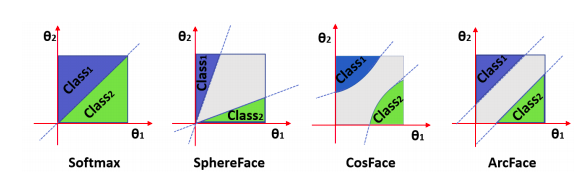

1/4/2021

# RAPIDS

+ Ref:

[rapid](https://rapids.ai/start.html)

[api docs](https://docs.rapids.ai/api)

[cuML](https://www.kaggle.com/cdeotte/rapids-cuml-knn-find-duplicates)

1. 
    The RAPIDS data science framework includes a collection of libraries for executing end-to-end data science pipelines completely in the GPU

2.
   But there actually isn't anything new to learn. All the API (commands) for Pandas work with RAPIDS cuDF and all the API (commands) for Scikit-Learn work with RAPIDS cuML. These RAPIDS libraries cuDF and cuML are the accelerated versions of Pandas and Scikit-Learn respectively. They run on GPU (instead of CPU) and give you the same API as Pandas and Scikit-Learn, and they give 10x to 1000x speed up!

``` The best way to find out is to try it.- ```

# Embedding , Cosine Distance, and ArcFace Explained.

[Reference](https://www.kaggle.com/c/shopee-product-matching/discussion/226279)


## Classification CNN

+ Usually we train a classification CNN by inputting images and getting a one hot vector output that present the class of image.
  
## Embeddings.
+ We want to compare two images and decide whether they are similar. Images are hard to compare, but numbers are easy to compare.
So we input an image into CNN and take the activations of the last layer before output layer, we get embeddings vector to compare.
+ Above that is vector of dimension 128. 

## Cosine Distance
+ We compare vectors by computing the distance between them. What is distance ?

  
+ Cosine of 0 degree is 1 and it is less than 1 for any other angle:

else:
    df['image_predictions'] = image_predictions
    df['text_predictions'] = text_predictions
    df['matches'] = df.applyrmula.png)
  
+ And cosine distance would be one minus the cosine of the angle from point one to the origin to point two. This equals 0 when the points are the same, and 1 when the points are far away.

## ArcFace

+ We would like similar classes to have embeddings close to each other and dissimilar 
  classes to be far from each other. Our model only trained to predict animals accurately.
  
+ ArcFace adds more loss to the training procedure to encourage similar class embeddings to be close and dissimilar embeddings to be far from each other



+ [Arcface with tensorflow](https://www.kaggle.com/chankhavu/keras-layers-arcface-cosface-adacos)
+ [Visualize model](https://www.kaggle.com/slawekbiel/arcface-explained/)
##  How similar is ArcFace concept to Siamese NN one?

+ If i understand correctly, they are different. With ArcFace you input one image at a time and get one embedding out. Next you compare images by comparing embeddings. With Siamese NN, you input a pair of images and the NN tells you if they are similar or not.

# Bert training and test model

reference in [here](https://www.kaggle.com/ragnar123/bert-baseline)

## Bert

## Bert with arcface

# CNN input size explained 

Reference in [here](https://www.kaggle.com/c/siim-isic-melanoma-classification/discussion/160147)